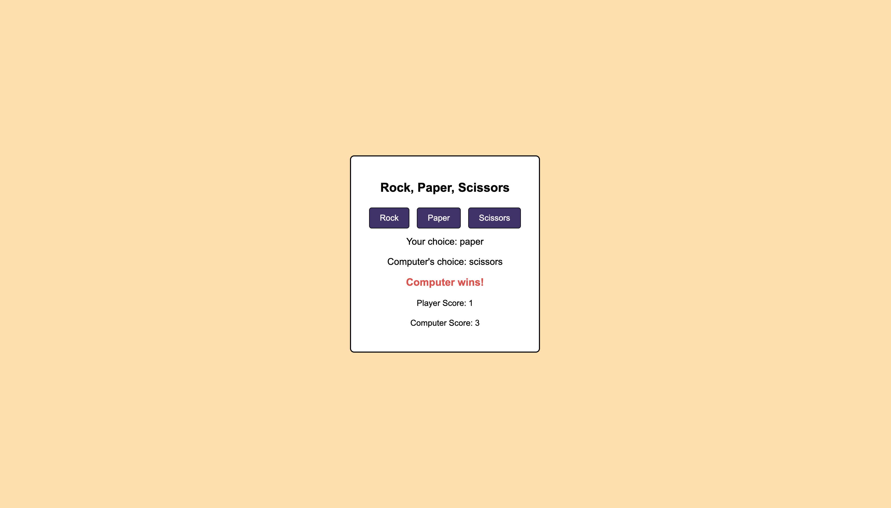

Name: Rock, Paper, Scissors IYB
    I chose this game because I thought it would be fun to make. My choices were bored button, rock paper scissors, and chopsticks. While chopsticks would've been fun I believe it would take me an entire year to finish.
Technologies used: HTLM, JS, CSS
External Resources: Help from parents (Jon & Dani Crosby)
Next Steps: Make a version of the game that is two player.
